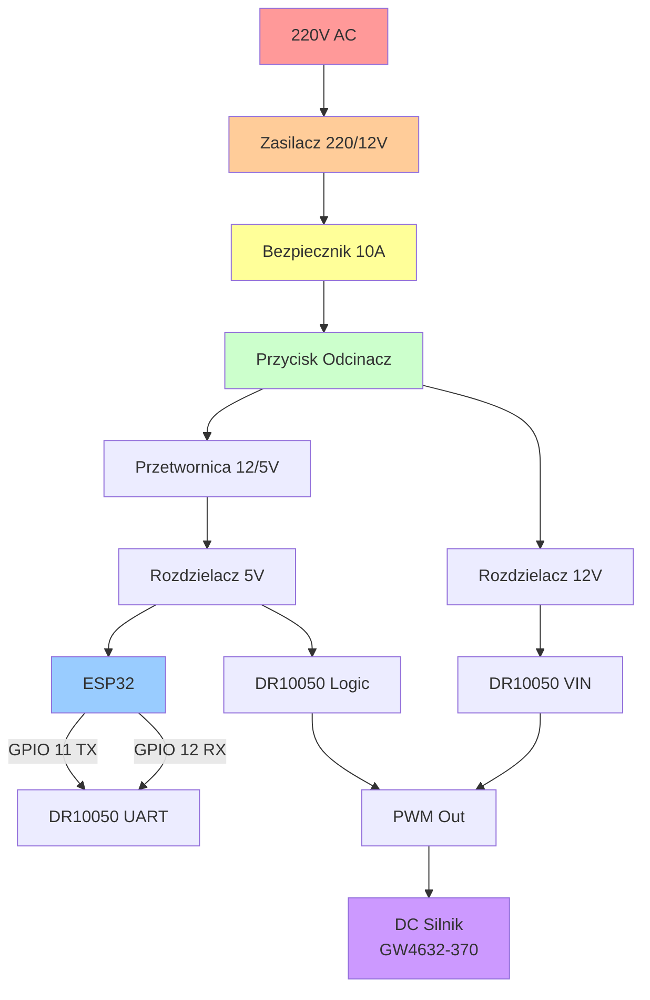

# ESP32 Elevator Control System - Installation Diagram

## System Overview

This document describes the electrical and control connections for the ESP32-based motor control system for elevator control.

## Power Supply Chain

```
220V AC → Zasilacz 220/12V → Bezpiecznik 10A → Przycisk Odcinacz
```

## Interactive System Diagram



## Power Distribution

### 12V Power Path
- **Zasilacz 220/12V** (220V AC to 12V DC converter)
- **Bezpiecznik 10A** (10A fuse for protection)
- **Przycisk Odcinacz** (Emergency cut-off button)
- **Rozdzielacz 12V** (12V power distributor)

### 5V Power Path
- **Przetwornica 12/5V** (12V to 5V converter)
- **Rozdzielacz 5V** (5V power distributor)

## Component Connections

### ESP32 Microcontroller
- **Power**: 5V from Rozdzielacz 5V
- **GPIO 11**: Connected to DR10050 TX (UART Transmit)
- **GPIO 12**: Connected to DR10050 RX (UART Receive)

### DR10050 Motor Driver
- **Logic Power**: 5V from Rozdzielacz 5V
- **Motor Power**: 12V from Rozdzielacz 12V (VIN)
- **UART Communication**: 
  - TX connected to ESP32 GPIO 11
  - RX connected to ESP32 GPIO 12
- **PWM Output**: 12V to DC Motor

### DC Motor (GW4632-370)
- **Model**: GW4632-370 Worm Gear Motor
- **Power**: 12V PWM from DR10050 driver
- **Control**: Speed and direction via PWM from DR10050

## Safety Features

1. **Bezpiecznik 10A**: Fuse protection for the entire system
2. **Przycisk Odcinacz**: Emergency cut-off switch
3. **Isolated Power**: Separate 5V logic and 12V motor power

## Communication Protocol

- **Interface**: UART (Serial Communication)
- **Baud Rate**: Configurable (typically 9600 or 115200)
- **Data Format**: 8N1 (8 data bits, no parity, 1 stop bit)
- **Control Commands**: Motor speed, direction, start/stop

## Installation Notes

1. Ensure proper grounding for all components
2. Use appropriate wire gauge for 12V motor power
3. Keep UART communication wires away from power lines
4. Test emergency cut-off button functionality
5. Verify fuse rating matches motor requirements

## Troubleshooting

- **No Motor Response**: Check 12V power to DR10050
- **ESP32 Not Communicating**: Verify 5V power and UART connections
- **Motor Runs Continuously**: Check UART communication and stop commands
- **System Shutdown**: Check fuse and emergency button

## Technical Specifications

- **Input Voltage**: 220V AC
- **System Voltage**: 12V DC (motor), 5V DC (logic)
- **Motor Type**: DC Worm Gear Motor
- **Control Interface**: UART via ESP32
- **Safety**: 10A fuse + emergency cut-off